# nodeJS-REST_API-practice
* rest api는 정보는 주고받는 자체라서 클라이언트에서 해주기보다는 서버에서 comfiguration 해주는 것이 관건이다.
* nodeJS 다운받기, npm 다운받기
* node를 다운받으면 npm(node package manager) 이 같이 딸려오는데 이것은 node.js에서 필요한 모듈들을 다운받을 수 있게 도와주는 매니저이다.
* REST API 요청시 req => 클라이언트에서 요청한것
* REST API 요청시 res => 서버에서 응답해주는것
* REST API 순서 매우 중요. client 가 요청시 순서대로 코드를 읽어서 routes를 인식하기 때문에
* 요청 구현시 (endPoint 와 콜백함수 넣어주기)

## 프로젝트 생성 및 셋팅
1. npm init - 프로젝트 정보 셋팅하기
    * package.json이 생성된다.
2. npm install express - 서버를 핸들링할때 주로 사용되는 dependency
    * package.json.lock이 생성된다.
* postman설치

## express dependency 사용해서 서버만들기
1. (서버를 구현할)server.js 파일 생성하기 ->  default 셋팅 후 node server로 돌려서 테스트해보기
````javascript
// server.js

const express = require('express'); // 설치한 express기 사용위해 require 시켜주
const server = express(); // 서버 만들기

server.listen(3000, () => { // 포트 열어주고 서버에세 전달
  console.log('* The server is running *')
})
````

## CRUD (Create, Read, Update, Delete)
* Post or Get 요청으로 유저 Create, Read
* Put or Delete 요청으로 유저 Update, Delete

*** 

## mockup data 생성해서 REST API 테스트 해보기 (아직 mongoDB 사용을 안하므로)
* db가 따로 없어서 테스트용으로 간단히 유저생성
````javascript
...
// server.js
const users = [ // db가 따로 없어서 테스트용으로 간단히 유저생성
  {
    id:'A',
    name: 'blair',
    email: 'blair441035@gmail.com'
  },
  {
    id:'B',
    name: 'yj',
    email: 'yj441035@gmail.com'
  }
];
...
````

### GET API text
````javascript
// server.js
...
// get 요청 구현(endPoint 와 콜백함수 넣어주기)
server.get('/api/user', (req, res) => { // client에서 /api/user endpoint이동시
  res.json(users); // 서버는 응답
});
...
````
* 이제 브라우저에서 http://localhost:3000/api/user 접속시 아래처럼 서버가 보낸 데이터들이 보인다.
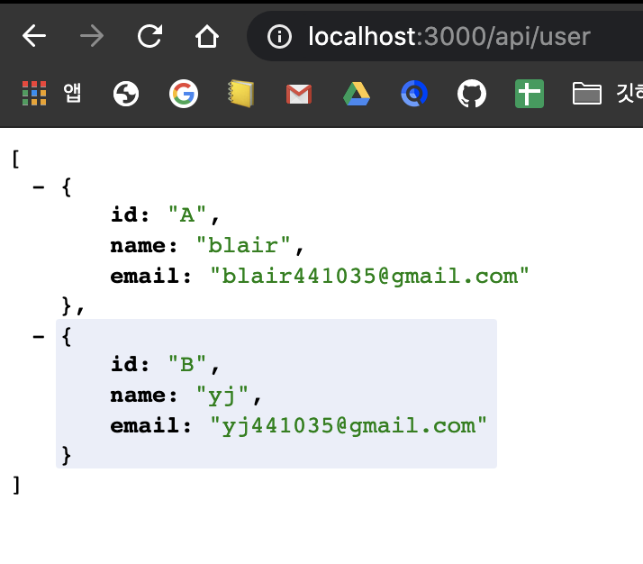

### POST API test
* postman에서 Headers를 
    * Content-Type : application/json 로 설정 후 api 날려보기
* postman 사용해서 테스트(post요청은 브라우저로 테스트하기 힘들다.)
* 클라이언트가 보낸것은 request의 body에 담겨온다
* 클라이언트에서 json형태로 정보를 보내 요청해올시 서버가 json을 이해하려면 body-parser가 필요함
    * require하고 use해주기
    
````javascript
// server.js
...
const bodyParser = require('body-parser'); // post요청시 만약 client가 json형식으로 보내면 그것을 서버가 받아서 이해하기 위해서 bodyparser가 필요하다.
server.use(bodyParser.json()); // require해온 bodyParser를 서버가 사용할 수 잇게 해주기

server.post('/api/user', (req, res) => {
  console.log(req.body); // 클라이언트가 보낸것들을 body에서 확인 가능
  users.push(req.body) // users에 추가
  res.json(users); // 서버는 응답
});
...
````
* postman에서 post test
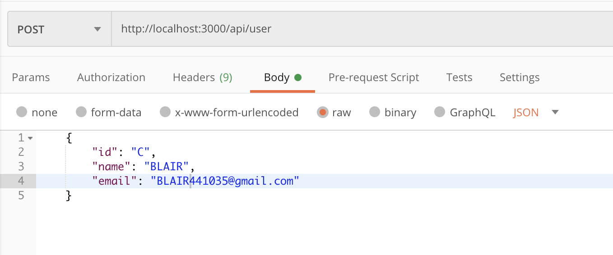
*  console.log(req.body); 를 해줬기 때문에 서버쪽(터미널)에 클라이언트가 보낸 정보가 console.log 됨
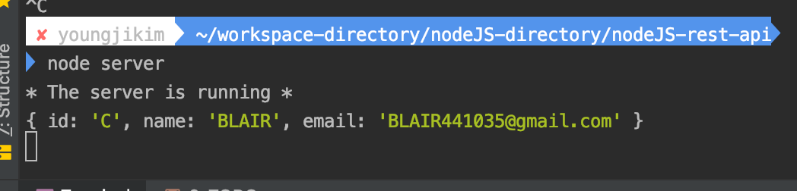
*   res.json(users); 로 추가해줬기 때문에 브라우저에 찍힌 res.json(users)의 결과는 기존 data 에 추가됨 
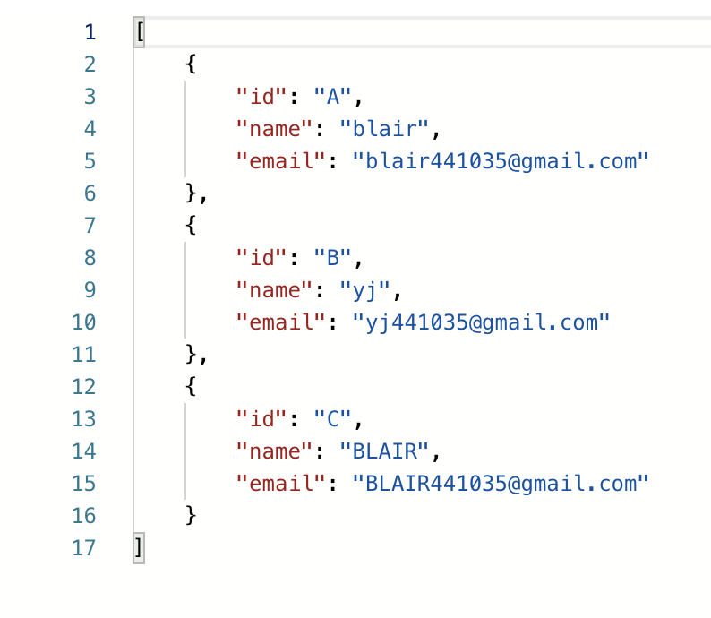

### GET 요청시 특정한 유저의 정보를 얻을 - ID parameter설정하기때
* 클라이언트가 특정유저의 id를 url에 담아서 get요청을 서버에 보내고 서버에서 확인해서 응답해주기
````javascript
...
// server.js

// REST API 순서 매우 중요. client 가 요청시 순서대로 코드를 읽어서 routes를 인식하기 때문에
// ID parameter 사용해서 특정 사용자 인식하기
server.get('/api/user/:id', (req, res) => {
  // console.log(req.params.id); // 브라우저에 주소를 친 /api/user/:id에서 id가 서버에 찍힌다.
  const user = users.find((user) => {
    return user.id === req.params.id; // users에 있는 id중 주소로 받은 :id와 동일한 아이디있으면 그 유저정보를 반환해서 변수에 저장
  });

  if(user) { // 주소로 받은 id와 동일한 id를 가진 유저를 찾았다면
    res.json(user); // 서버는 클라이언트에게 유저정보를 건네준다
  } else { //  못찾을시
    res.status(404).json({errorMessage: "User wad not found"}) // 응답코드 4040보내고 에러메세지를 보내준다.
  }

});
...

````
* 유저 찾았을 때
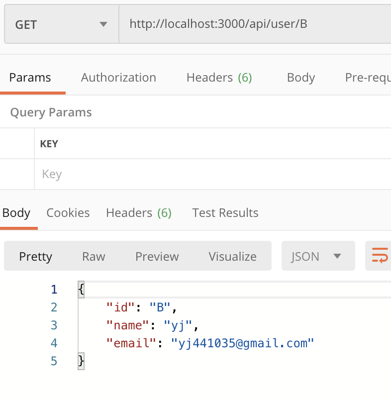
* 데이터에 없는 유저를 파라미터로 받았을 때
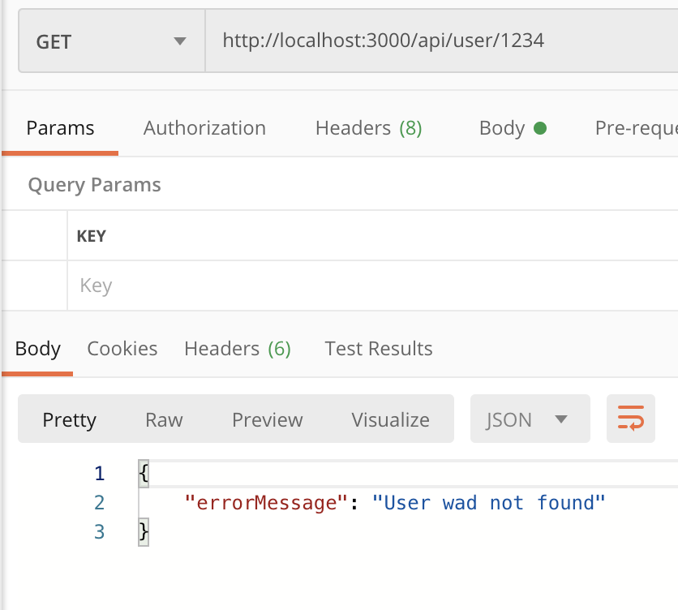


### PUT API - data Update
````javascript
// server.js

...
// 유저정보 업데이트 (ID parameter 사용해서 특정 사용자 정보 불러와 업뎃해주기)
server.put('/api/user/:id', (req, res) => {
  // 클아이언트에게 받은 ID와 일치하는 ID를 가진 user의 IDX돌려줌
  let foundIdx = users.findIndex(user => user.id === req.params.id);

  if(foundIdx === -1) { // 일치하는게 없으면 -1
    res.status(404).json({errorMessage: "User wad not found"}) // 응답코드 4040보내고 에러메세지를 보내준다.
  } else {
    users[foundIdx] = {...users[foundIdx], ...req.body}; // if body에 바뀐 name or email이 담겨왔을 시 spread로 풀어지기때문에 업데이트 된다.
    res.json(users[foundIdx]); // 업뎃된 특정 유저의 정보를 클라이언트에게 응답해주기
  }
});
...
````
* postman에서 Headers를 
    * Content-Type : application/json 로 설정 후 api날려보기
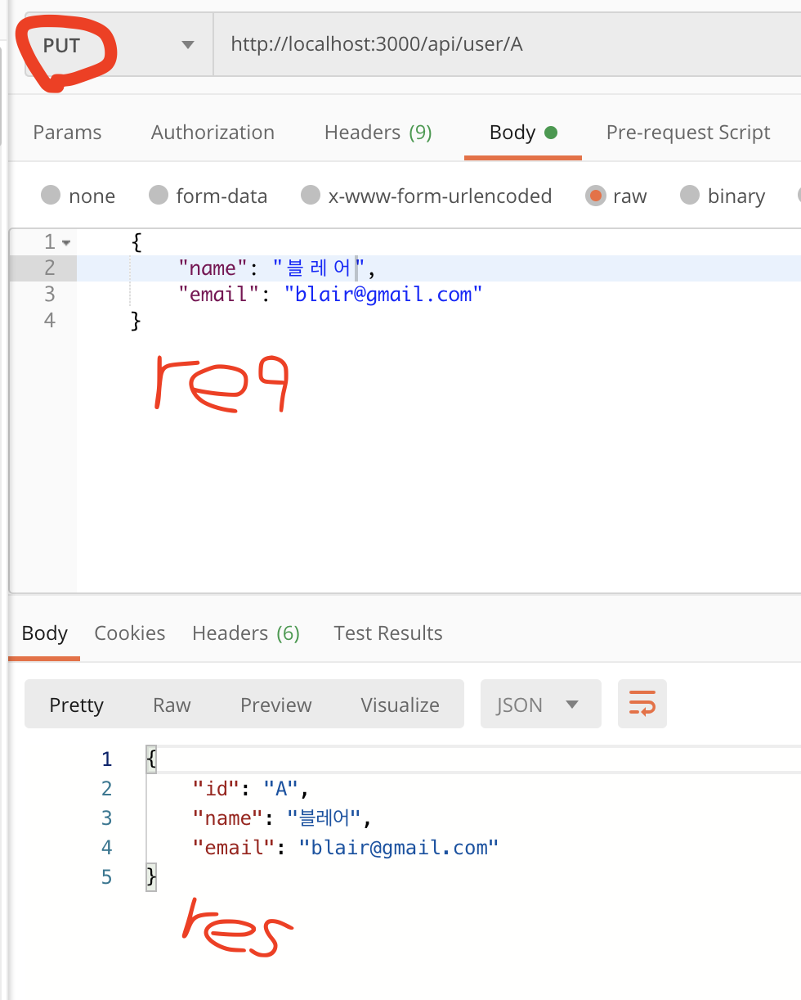
* 이제 다시 Get으로 모든 users 확인해보면 수정이 반영되어있다.
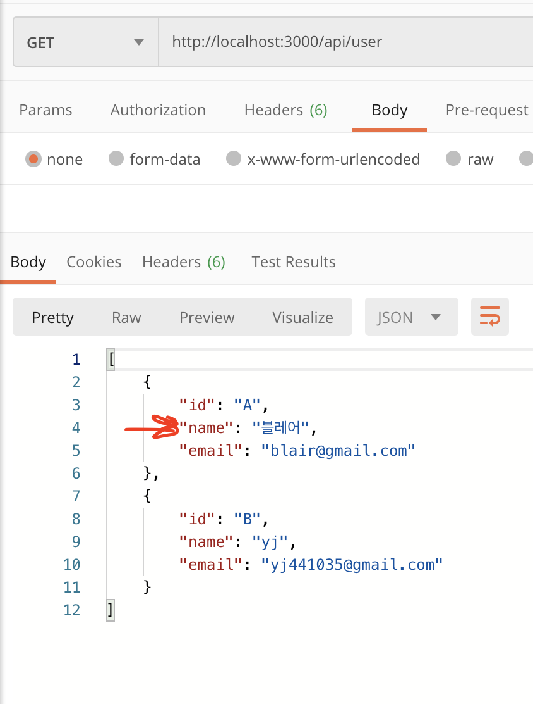


### DELETE API - data Delete
````javascript
// server.js
...
// DELETE - 유저삭제
server.delete('/api/user/:id', (req, res) => {
  let foundIdx = users.findIndex(user => user.id === req.params.id);

  if(foundIdx === -1) {
    res.status(404).json({errorMessage: "User wad not found"})
  } else {
    let foundUser = users.splice(foundIdx,1); // 시작점부터 1개 잘라내기
    res.json(foundUser[0]); // 삭제된거 응답으로 돌려줌
  }
});
...
````
* 이제 특정 사용자의 아이디를 url담아서 delete api날리면
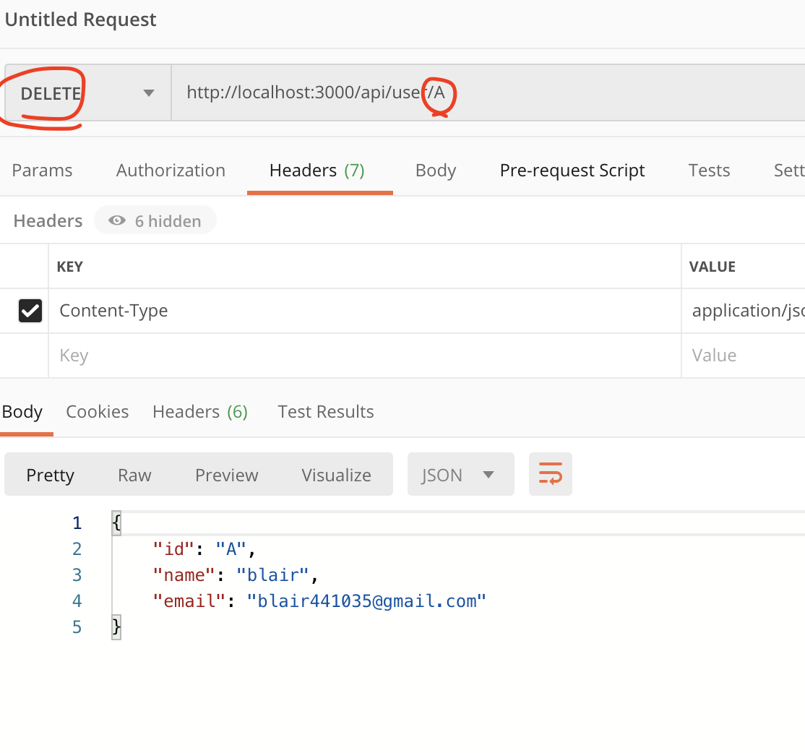

* 그리고 다시 Get으로 모든 users 확인해보면 삭제가 반영되어있다.
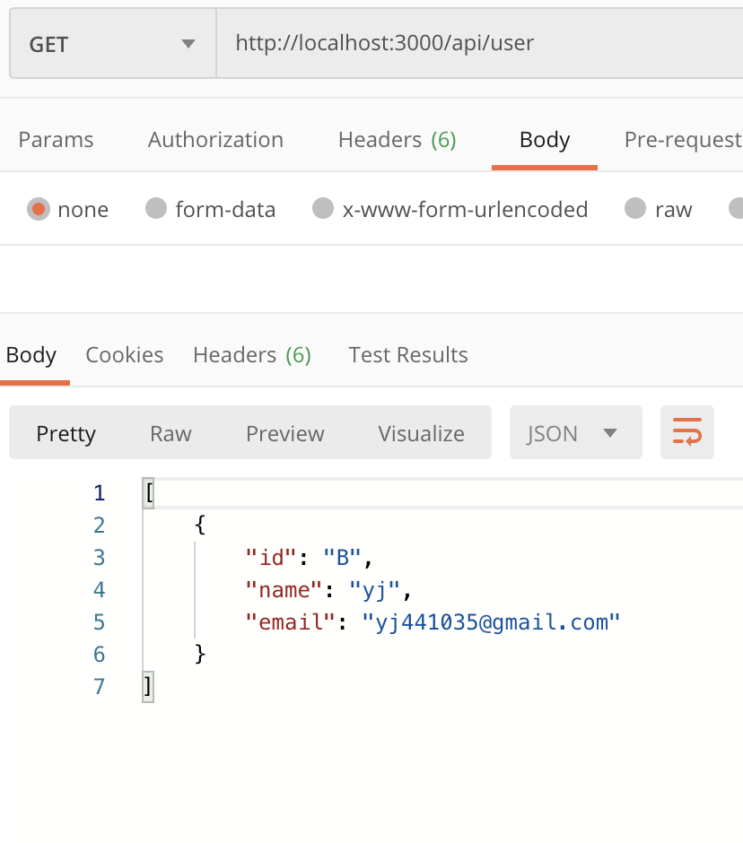
 
*** 
 
## MongoDB 구축하기 (useMongoDB 경로에서 작업)
* 로그인 후 클러스터 생성하기
* connect
    * 중요한 프젝은 아니기때문에 0.0.0.0로 모든 아이피 허용 
    

### 새 폴더 만들고 셋업하기 - useMongoDB 폴더생성
1. useMongoDB 경로로 들어와서 npm init --y : default package.json이 바로 생성된다.
2. npm install express mongoose
3. 몽고디비 주소에는 개인정보가 있으니 .env파일 생성해서 여기에 담기
    * MONGODB_URL = mongodb+srv://ID:PW@cluster0-kvscn.mongodb.net/<dbname>?retryWrites=true&w=majority
4. useMongoDB/index.js 파일 생성하기
    * npn install dotenv설치 후 config함수실행하고 파일명(경로) 인자넣기 
        * .env파일의 환경변수를 다른곳에서 편하게 "precess.env.변수명" 으로 접근 가능하게하기 위해서!
    * 몽구스 require -> 몽구스와 몽고디비 연결(인자로 .env의 몽고디비 아이디불러와서 넣기)
    
````javascript
// useMongoDB/index.js

const mongoose = require('mongoose');
const dotenv = require('dotenv');

dotenv.config({path:'.env'}); // 설치한 dotenv사용위해 config메소드실행하고 경로인자 넣어주기
// 혹은 require하면서 바로 연결해줘도 된다.require('dotenv').config({path:'.env'});

mongoose.connect(process.env.MONGODB_URL, { useNewUrlParser : true}, (err) => {  // 생성했던 몽고디비를 몽구스에 연결
  if(err) { // 콜백함수로 연결실패히 err 출력
    console.log(err)
  } else { // 연결 성공시 성공 메세지 출력
    console.log("* Connected to database successfully *");
  }
});
````
### model생성
* [mongoose 문서참고](https://mongoosejs.com/docs/models.html)
* 문서 형식에 맞춰서 만들어 줘야 한다.
* models 폴더 생성 -> User.js 파일 생성
    * 모델파일들은 모두 대문자
    
#### User.js (User 모델 생성)
* mongoose불러오고 스키마 불러와서 스키마를 만들수있게 셋팅하기
````javascript
// useMongoDB/models/User.js

const mongoose = require('mongoose');
// const Schema = mongoose.Schema
const {Schema} = mongoose; // 위와 같다.(구조분해 할당)


// 스키마 폼 생성
const userSchema = new Schema({
    email: {
      type: String,
      required: true
    },
    name: String,
    age: {
      type: Number,
      min: 18,
      max: 50
    }
  },
  {
    timestamps: true // 데이터 생성한 시점, 수정될경우 시점이 기록된다.
  }
);

module.exports = mongoose.model('User', userSchema); // 생성된 모델을 사용할 수 있게 exports 시켜주기
````

### express로 서버 생성 후 포트열고 -> 몽고디비 연결하기!
````javascript
// useMongoDB/index.js 수정!!

const express = require('express'); // 서버만들기위해 require
const mongoose = require('mongoose');
const server = express(); // 서버생성
const dotenv = require('dotenv');
dotenv.config({path:'.env'}); 

server.listen(3000, (err) => { // 포트지정해서 서버 열고
  if(err) {
    console.log(err);
  } else { // 서버가 잘 열리면 몽고디비 바로 연결
    mongoose.connect(process.env.MONGODB_URL, { useNewUrlParser : true}, (err) => {  // 생성했던 몽고디비를 몽구스에 연결
      if(err) { // 몽고디비 연결실패 err 출력
        console.log(err)
      } else { // 연결 성공시 성공 메세지 출력
        console.log("* Connected to database successfully *");
      }
    });
  }
});
````

### 생성했던 모델 사용해보기! - GET요청 (index.js에 코드 추가)
````javascript
// useMongoDB/index.js 수정!!
...
const User = require('./models/User'); // 모델을 사용하기 위해 rewuire 해주기
...
// GET - 사용자가 '/'로 접속시 User model 만드는 요청 실행
server.get('/', (req, res) => {
  const newUser = new User();
  newUser.email = "blair04@gmail.com"; // 모델스키마에 잡아놨던 폼의 속성마다 값 넣어주기
  newUser.name = "블레어";
  newUser.age = 1;

  // 위에서 만들 uewUse(새로만든 User모델을) mondoDB에 저장 (프라미스객체 돌려준다)
  newUser.save()
    .then((user) => { // 저장이 잘 됬다면
      console.log(user);
      res.json({
        message: "User Create Successfully"
      });
    })
    .catch((error) => { // 저장 실패하면
      res.json({
        message: "User wad not successfully created",
        err: error.toString()
      })
    })
});
...
````

* 이제 브라우저에서 "http://localhost:3000/"에 접속해보면 
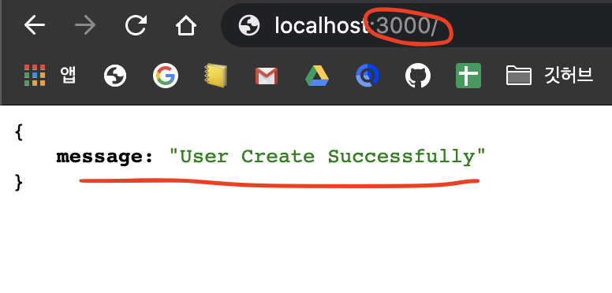
* 그리고 서버쪽에도 생성된 user가 찍힌다.
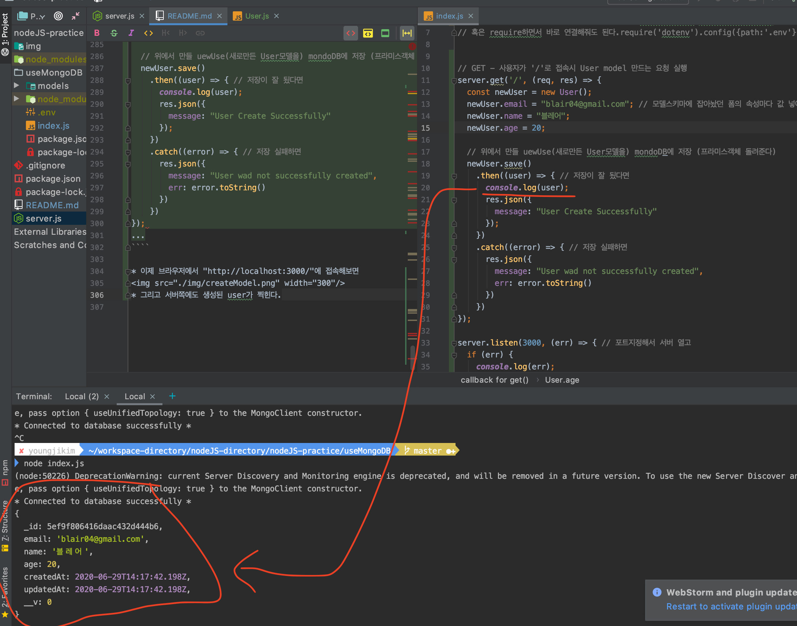
